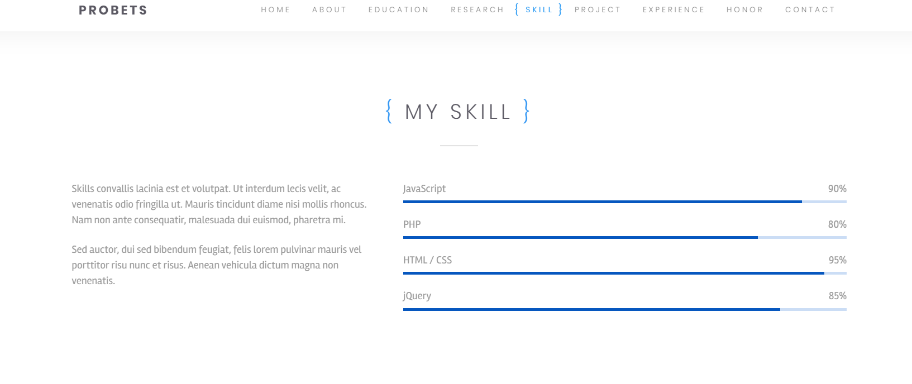

# 项目简介

本项目意在完成一个个人简历网页项目

现在项目主要完成了九个前端展示和部分后端代码，分别是

1. 主页界面
2. 自我简介界面
3. 教育经历界面
4. 科研经历界面
5. 技术界面
6. 项目经历界面
7. 学生工作经历界面
8. 荣誉展示界面
9. 联系我界面

# Project Brief Introduction

This project aims to complete a resume page project.

There are nine functions implemented so far but the web back end isn't finished.

1. Home Page
2. About Me Page
3. Education Page
4. Research Page
5. Skill Page
6. Project Page
7. Experience Page
8. Honor Page
9. Contact Me Page

## About Me Page

The pages are as follows.

## Education Page

The pages are as follows.

## Research Page

The pages are as follows.

## Skill Page

The pages are as follows.

## Project Page

The pages are as follows.

## Experience Page

The pages are as follows.

## Honor Page

The pages are as follows.

## Contact Me Page

The pages are as follows.

